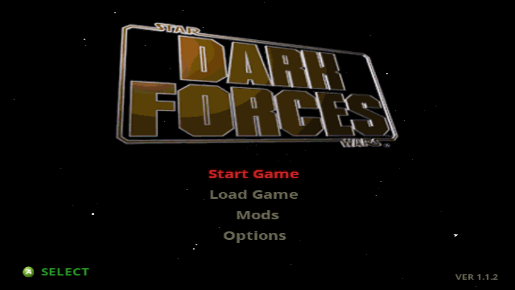
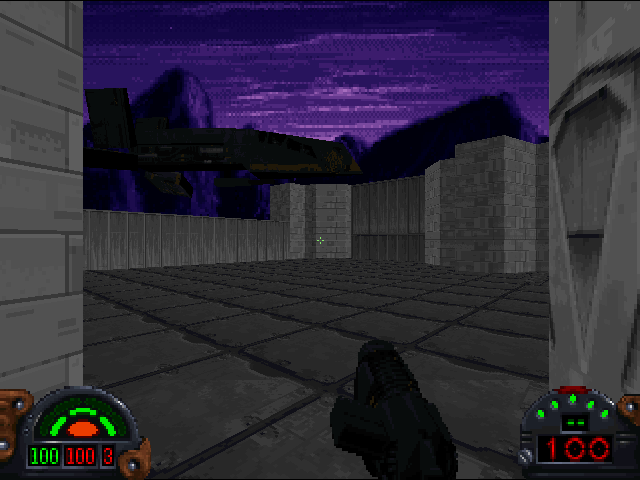
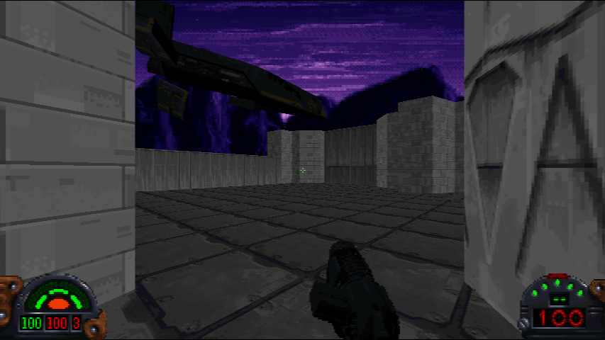

# TheForceEngineXbox

<p align="center">
  
</p>

TheForceEngineXbox is an original Xbox port of
[The Force Engine](https://github.com/luciusDXL/TheForceEngine), the open-source
Dark Forces engine recreation.

This fork builds a real `default.xbe` for retail Xbox hardware, XEMU, and
CXBX-R. It does not include Star Wars: Dark Forces. You need your own PC copy
of the game.

## Download

Use the latest package from the
[GitHub Releases](https://github.com/GTTeancum/TheForceEngineXbox/releases)
page:

```text
TheForceEngine-Xbox-Install.zip
```

The zip is an overlay package. Copy your PC Dark Forces install to the Xbox
first, then extract this zip over it.

## Screenshots

<p align="center">
  
</p>

<p align="center">
  
  
</p>

The screenshots were captured with XEMU's native screenshot function. The
gameplay pair uses the same build and game data; only the Xbox dashboard aspect
ratio setting differs.

## 1.1.2 Patch Notes

- 4:3 and 16:9 now follow the Xbox dashboard aspect-ratio setting automatically.
- 480i and 480p are selected independently from the dashboard's progressive-scan
  setting and the connected AV pack's capabilities.
- Removed the in-game forced output selector, saved output-mode override, and
  `tfe_force_480p.txt`/`tfe_force_720p.txt` debug overrides.
- Widescreen gameplay uses a wider horizontal field of view instead of stretching
  the 4:3 picture.
- Fixed widescreen datapad/pause transitions and background alignment.
- 720p remains disabled in this release.
- Updated the in-game main-menu version label to `VER 1.1.2`.

## Install

1. On your Xbox hard drive, make a folder for the game.

   Example:

   ```text
   F:\Games\Dark Forces\
   ```

2. Inside that folder, make a folder named `DARK`.

   Example:

   ```text
   F:\Games\Dark Forces\DARK\
   ```

3. Copy your PC Dark Forces game files into the `DARK` folder.

   The `DARK` folder should contain the normal game data files, such as:

   ```text
   DARK.GOB
   SOUNDS.GOB
   TEXTURES.GOB
   SPRITES.GOB
   LFD\
   ```

4. Optional: if you own the Remastered version and you want the Avenger
   prototype level playable as a mod, copy `extras.gob` into the `DARK` folder
   too.

5. Extract `TheForceEngine-Xbox-Install.zip` into the main game folder, not
   inside `DARK`.

   Example:

   ```text
   F:\Games\Dark Forces\
   ```

6. Let it overwrite files if your file manager asks.

7. Launch `default.xbe`.

## What The Zip Adds

The release package includes the files that are needed for the Xbox port and
are not part of the original PC game:

```text
default.xbe
default_XSIMAGE.xbx
default_XTIMAGE.xbx
TitleMeta.xbx
TitleImage.xbx
SaveImage.xbx
box art.png
README.txt

DARK\effects.json
DARK\pickups.json
DARK\projectiles.json
DARK\weapons.json

ExternalData\DarkForces\Mods\DF21\df21_catalog_xbox.json
ExternalData\DarkForces\Mods\DF21\thumbs_128x80_rgb565\*.xbt
```

The four JSON files in `DARK` are The Force Engine gameplay data files. They
are required by the Xbox build.

The DF21 catalog and thumbnail cache are included so the mod browser can show
metadata and preview images. The mod levels themselves are not included.

## Mods

This release does not redistribute mods. To install a mod you own or have
downloaded separately, create a `Mods` folder next to `default.xbe` and `DARK`,
then extract each mod into its own subfolder:

```text
Mods\<mod folder>\
```

Example:

```text
F:\Games\Dark Forces\Mods\ats2lp_modern\ats2lp.gob
F:\Games\Dark Forces\Mods\ats2lp_modern\DFBRIEF.LFD
F:\Games\Dark Forces\Mods\ats2lp_modern\readme.txt
```

The `.gob` file must be directly inside that mod folder. If a downloaded mod
extracts to an extra wrapper folder, move the actual mod files up one level so
the layout matches the example. Loose `.zip` files in `Mods` are ignored on
Xbox.

If you own the Remastered version, copying `extras.gob` into `DARK` enables the
Avenger prototype level as a mod entry. `extras.gob` is not included in this
project or in the release zip.

## Current State

This is the 1.1.2 release. The focus is hardware stability and a complete
couch-playable Dark Forces experience.

Working in this port:

- Original Xbox `default.xbe` output.
- Software-rendered gameplay presented through the Xbox D3D8 backend, with
  4:3/16:9 and 480i/480p output inherited from the Xbox dashboard video
  settings. Aspect ratio and progressive scan are inherited independently.
- Native Xbox start menu, load menu, pause/datapad screens, mod browser, and
  Options menu split into Controls, Video, and Audio submenus.
- XInput controller support with remappable core actions, separate X/Y aim
  sensitivity, right-stick deadzone control, and right-stick Y-axis inversion.
- Video settings for adjustable screen safe zone width, height, and shift.
- Audio settings for in-game volume control.
- Mission briefing flow, mission completion flow, and difficulty selection.
- Save/load support using the Xbox title save area, including save thumbnails.
- DirectSound audio path for game audio.
- DF21 metadata and thumbnail support for the mod browser.

Known limitations:

- 720p output is disabled. The release supports dashboard-selected 4:3/16:9 at
  480i or 480p.
- The hardware world renderer is not enabled for shipping. It remains in the
  tree for future work, but the release build uses the known-good software
  renderer.
- Mods are not bundled. They must be installed separately.
- Star Wars: Dark Forces game data is not bundled and will never be
  redistributed here.

## Build From Source

Most users should download the release zip instead of building from source.

The current command-line build path uses the checked-in `build_xbox.bat` script:

```cmd
build_xbox.bat clean
build_xbox.bat
```

The build script currently expects:

- XDK 5558 at `C:\XDK_5558\XDK\xbox`
- VC71 tools from that XDK
- XDK 5849 headers available at `C:\XDK\xbox\include`
- Python on `PATH`

Successful builds output:

```text
build\xbox\release\default.xbe
```

Always test release builds on real Xbox hardware before treating a change as
shipping-ready. CXBX-R is useful for iteration, but real hardware is the target.

Release maintainers must follow
[the Xbox release checklist](docs/xbox_release_checklist.md). The repository-root
`box art.png` is a required file in every release package.

## Credits

- The Force Engine team and contributors, led by
  [luciusDXL](https://github.com/luciusDXL), for The Force Engine.
- Microsoft for Xbox and the Xbox development tools.
- LucasArts for Star Wars: Dark Forces.

## License

Same as upstream The Force Engine. See [LICENSE](LICENSE).

This project does not contain or redistribute copyrighted Star Wars: Dark Forces
game assets.
